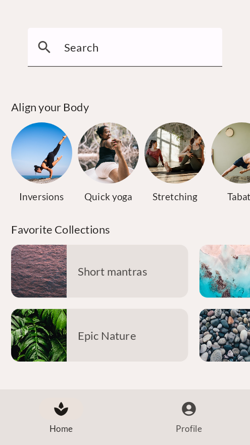
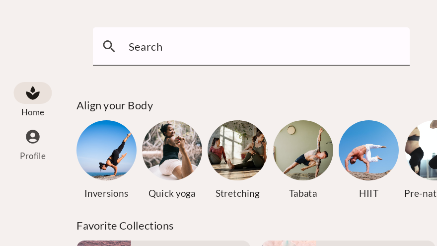

# PAMN-Codelabs
## Codelabs realizados
- Adaptive UI Codelab
- Basic Layouts Codelab
- Jetpack Compose Codelab
- Theming Codelab
- Compose Article
## Arquitecturas observadas en el desarrollo
Durante el desarrollo de estos codelabs hemos experimentado con distintas arquitecturas de software, entre ellas:

- Modelo–Vista–Controlador (MVC)
- Modelo–Vista–VistaModelo (MVVM)
- Modelo–Vista–Intent (MVI)

En los primeros codelabs (Basic Layouts, Adaptive UI), el enfoque es más cercano a MVC, ya que la lógica, la vista y los datos están menos desacoplados.


En los codelabs más avanzados (como Jetpack Compose y Theming), se adopta un enfoque MVVM, utilizando state hoisting y promoviendo la separación entre la capa de datos (Model) y la de interfaz (View), con el ViewModel como intermediario.

Algunos ejercicios también muestran ideas del patrón MVI, especialmente en el manejo de estados inmutables y flujos unidireccionales de datos (por ejemplo, cuando la UI responde a un state derivado de las acciones del usuario).

## Ubicación del código realizado

```
.
└── PAMN-Codelabs
    ├── AdaptiveUiCodelab
    │   ├── app
    │   ├── build.gradle.kts
    │   ├── gradle
    │   ├── gradle.properties
    │   ├── gradlew
    │   ├── gradlew.bat
    │   ├── README.md
    │   └── settings.gradle.kts
    ├── BasicLayoutsCodelab
    │   ├── app
    │   ├── ASSETS_LICENSE
    │   ├── build
    │   ├── build.gradle
    │   ├── CONTRIBUTING.md
    │   ├── gradle
    │   ├── gradle.properties
    │   ├── gradlew
    │   ├── gradlew.bat
    │   ├── LICENSE
    │   ├── local.properties
    │   ├── README.md
    │   ├── settings.gradle
    │   └── spotless
    ├── ComposeArticle
    │   ├── app
    │   ├── build.gradle.kts
    │   ├── gradle
    │   ├── gradle.properties
    │   ├── gradlew
    │   ├── gradlew.bat
    │   └── settings.gradle.kts
    ├── JetpackCompose_States
    │   ├── app
    │   ├── build
    │   ├── build.gradle.kts
    │   ├── gradle
    │   ├── gradle.properties
    │   ├── gradlew
    │   ├── gradlew.bat
    │   ├── local.properties
    │   └── settings.gradle.kts
    ├── README.md
    └── ThemingCodelab
        ├── app
        ├── ASSETS_LICENSE
        ├── build.gradle
        ├── CONTRIBUTING.md
        ├── debug.keystore
        ├── gradle
        ├── gradle.properties
        ├── gradlew
        ├── gradlew.bat
        ├── LICENSE
        ├── README.md
        ├── screenshots
        ├── settings.gradle.kts
        └── spotless
```

Cada carpeta contiene una subcarpeta donde se encuentra el código desarrollado por nosotros.

## Aspectos interesantes de los codelabs
- En Adaptive UI Codelab nos pareció interesante visualizar las diferencias en la presentación del contenido entre dispositivos móviles y tablets, y cómo Compose permite adaptar el diseño de forma dinámica.
- En States Codelab nos llamó la atención observar cómo el recolector de basura de Android gestiona la memoria y el ciclo de vida de los componentes, manteniendo los estados en diferentes tipos de elementos de la interfaz.
- En Theming Codelab destacamos la integración de las clases y componentes de Material Design, su coherencia estética y la facilidad con la que se pueden personalizar colores, tipografías y estilos globales.
- En Jetpack Compose Codelab resultó interesante comprender cómo se construye la interfaz de usuario de forma declarativa, utilizando funciones Composable y un enfoque reactivo basado en el estado.
<p align="center">
  
  
</p>

- En Compose Article Codelab nos pareció destacable la claridad con la que se organiza el contenido dentro de los layouts y cómo se aplican los principios de diseño modular para mejorar la reutilización de componentes.

## Uso de la IA
Hemos utilizado ChatGPT y Gemini para la resolución de dudas, asistencia en la escritura del código y procesos de debugging

## Autores
- Jerónimo Ómar Falcón Dávila